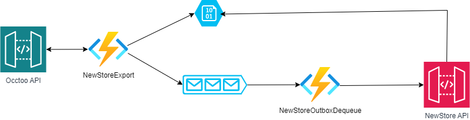

# Newstore Formatter 
This project gives an example on how to create a formatter from the Occtoo API into Newstore APIs

**Docs:** https://docs.occtoo.com/

The solution has functions working as shown below:



NewStoreExport (HttpTrigger) - Called to get products from the Occtoo API. It creates json files on blobstorage and send a message to the queue

NewStoreOutboxDequeue (QueueTrigger) – Picks up the queue items and sends it to Newstore 

## Running the app
### 1. Get the code
Clone the repository and open the solution
### 2. Add a localsettings.json file and fill out the details of your project
```json
{
  "IsEncrypted": false,
  "Values": {
    "AzureWebJobsStorage": "UseDevelopmentStorage=true",
    "FUNCTIONS_WORKER_RUNTIME": "dotnet",
    "newStoreTenant": "{YourTenant}",
    "newStoreUser": "{YourUser}",
    "newStorePassword": "{YourPassword}",
    "newStoreQueue": "newstore-outbox",
    "occtooDestinationUrl": "https://global.occtoo.com/{YourCompany}/{DestinationName}/v1",
    "occtooTokenUrl": "https://destinations.occtoo.com/destinations/{DestinationId}/token",
    "occtooTokenId": "{YourTokenId}",
    "occtooTokenSecret": "{YourTokenSecret}"
  }
}
```

### 3. Start the application
Hit F5
